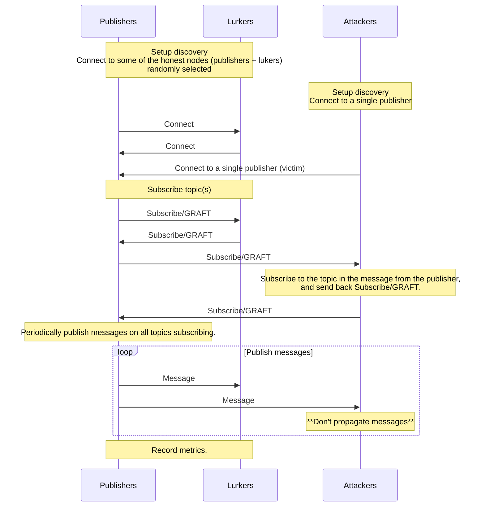

# Censoring Simulation

This simulation creates a number of malicious nodes which do not propagate
received messages. This simulation is aimed to help fine-tune gossipsub scoring
parameters to mitigate censoring attacks on gossipsub networks.

## Running the simulation

```shell
testground run composition -f censoring/compositions/censoring.toml --wait
```

## How the Simulation Works

Note: Attackers connect to a single publisher (victim). [`Publisher1` is the victim](https://github.com/sigp/gossipsub-testground/censoring/src/attacker.rs#L76) in this test plan.



## Dashboards

Please see the root [README](https://github.com/sigp/gossipsub-testground/blob/main/README.md) for how to run Grafana.

### Gossipsub Metrics

The metrics of gossipsub are recorded once the simulation has been completed. [All of the metrics on libp2p-gossipsub](https://github.com/sigp/gossipsub-testground/blob/censoring/src/honest.rs#L235-L275) are available in this dashboard.

Variables for this dashboard:

- `run_id`: The run_id for the test run you want to see.
- `topic`: The gossipsub topic, currently it's fixed to `emulate`.
- `instance_name`: Some panels in this dashboard need an instance name to be specified. (e.g. score_per_mesh histogram)


### Peer Scores

The peer scores are recorded periodically (every second) while the simulation is running.

Variables for this dashboard:

- `run_id`: The run_id for the test run you want to see.
- `instance_name`: It's default to `All`, you can select specific instances.


