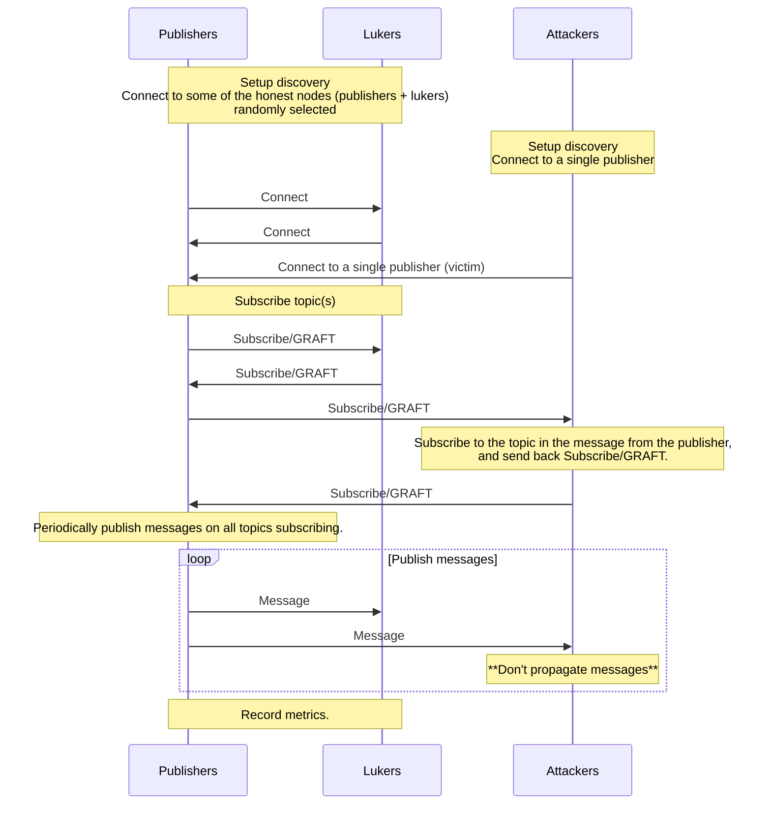

# emulation

## How to run

```shell
# Import test plans
git clone https://github.com/sigp/gossipsub-testground.git
testground plan import --from ./gossipsub-testground/

# Run `emulation` test plan
cd gossipsub-testground
testground run composition -f emulation/compositions/emulation.toml --wait
```

## What the emulation does

Note: Attackers connect to a single publisher (victim).



## Metrics / Scores

- Open Grafana: http://localhost:3000
- admin/admin by default

### Datasource settings

- URL http://testground-influxdb:8086
- Database testground


### Gossipsub metrics

The metrics of gossipsub are recorded once the emulation has been completed. All of the metrics available on libp2p-gossipsub are recorded.

```sql
SELECT * FROM "topic_msg_sent_counts" WHERE $timeFilter 
```


### Scores

The peer scores are recorded periodically (every second) while the emulation is running.

```sql
SELECT * FROM "scores" WHERE $timeFilter and instance_name = 'Publisher1' and run_id = 'cc7gl2k3r49i9pbqr9ng'
```

You can identify the score to get by [`instance_name`, `instance_peer_id`, or `run_id`](https://github.com/ackintosh/gossipsub-testground/blob/test-plan-emulation/emulation/src/honest.rs#L408-L410).

Note: [`Publisher1` is a victim in this test plan](https://github.com/ackintosh/gossipsub-testground/blob/0d715d79e0a75300e30fdacf97c7d9961fd6f5af/emulation/src/attacker.rs#L76).


