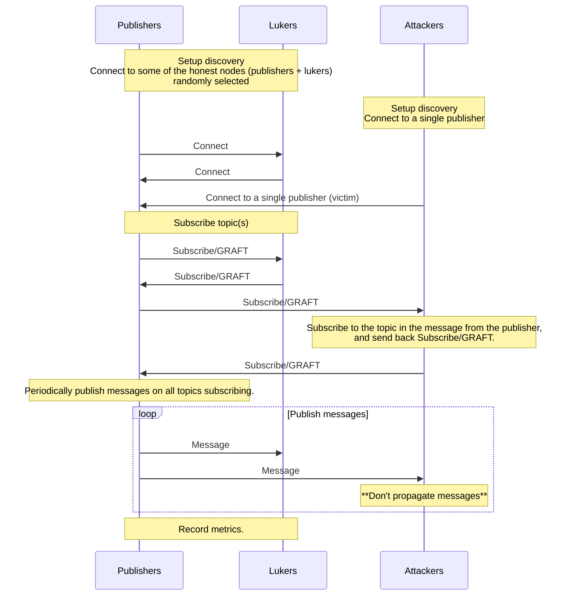

# emulation

## How to run

```shell
# Import test plans
git clone https://github.com/sigp/gossipsub-testground.git
testground plan import --from ./gossipsub-testground/

# Run `emulation` test plan
cd gossipsub-testground
testground run composition -f emulation/compositions/emulation.toml --wait
```

## What the emulation does

Note: Attackers connect to a single publisher (victim). [`Publisher1` is the victim](https://github.com/ackintosh/gossipsub-testground/blob/0d715d79e0a75300e30fdacf97c7d9961fd6f5af/emulation/src/attacker.rs#L76) in this test plan.



## Dashboards

Please see the root [README](https://github.com/sigp/gossipsub-testground/blob/main/README.md) for how to run Grafana.

### Gossipsub Metrics

The metrics of gossipsub are recorded once the emulation has been completed. [All of the metrics on libp2p-gossipsub](https://github.com/ackintosh/gossipsub-testground/blob/test-plan-emulation/emulation/src/honest.rs#L235-L275) are available in this dashboard.

Variables for this dashboard:

- `run_id`: The run_id for the test run you want to see.
- `topic`: The gossipsub topic, currently it's fixed to `emulate`.
- `instance_name`: Some panels in this dashboard need an instance name to be specified. (e.g. score_per_mesh histogram)


### Peer Scores

The peer scores are recorded periodically (every second) while the emulation is running.

Variables for this dashboard:

- `run_id`: The run_id for the test run you want to see.
- `instance_name`: It's default to `All`, you can select specific instances.


