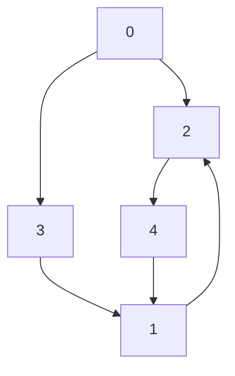

# Ethereum Consensus Simulation

This simulation mimics the timing, frequency and sizes of messages that would usually
occur on a normal Ethereum consensus gossipsub-network. The simulation can
specify the number of validators and nodes on the network in an attempt to
model various sizes of Ethereum consensus networks.

## Running the Simulation

This simulation can be run with the following command (from within the repos
root directory):

```sh
testground run composition -f ./eth_consensus/compositions/composition.toml --wait
```

Various aspects of the simulation can be modified. Please read the `eth_consensus/manifest.toml` to understand test parameters and `eth_consensus/compositions/composition.toml` to modify them.


## Influx DB Queries

The results of the simulation are stored in an Influx DB instance. Queries
inside grafana can be used to build dashboards. An example query is given:

`SELECT derivative("count", 10s) FROM "topic_msg_recv_bytes" WHERE $timeFilter GROUP BY "hash", "instance_name", "run_id"`

`derivative` = calculation of the rate
`hash` the topic
`instance_name` the number given to the instance inside the test run starting from 0
`run_id` the id of the run

## Controlling the Topology

The topology of the network can be created and visualised using the `utils/gen_topology` and `utils/gen_topology_files` crate.

The `gen_topology_files` binary can output json and dot files to visualise and
understand the topology of the network to be created.

There are a number of input parameters required for generating a network
topology, each of these can be customised in the composition file
`compositions/composition.toml`. 

- `seed`: int - This is what is used to seed the random number generator and
	can control differing variants of the topology by changing this number.
- `total_validators`: int - This is the total number of validators to be used
	within the network.
- `total_node_with_vals`: int - The total number of nodes that will be assigned
	validators
- `min_peer_per_node`: int - The minimum number of connections per node to
	target when generating the node topology
- `max_peers_per_node`: int  - The maximum number of connections per node to
	target when generating the node topology

These parameters can be set in the composition in order to generate a specific
topology for the simulation.

To visualise the topology, a dot file and json file can be produced by running:
```
cargo run --bin gen_topology_file <seed> <total_validators>
<total_node_with_vals> <min_peer_per_node> <max_peer_per_node>
<output-dot-file> <output-json-file>
```

an example is:

```
cargo run --bin gen_topology_file 40 200 2 3 2 3 output.dot output.json
```

Which produces the following topology:


