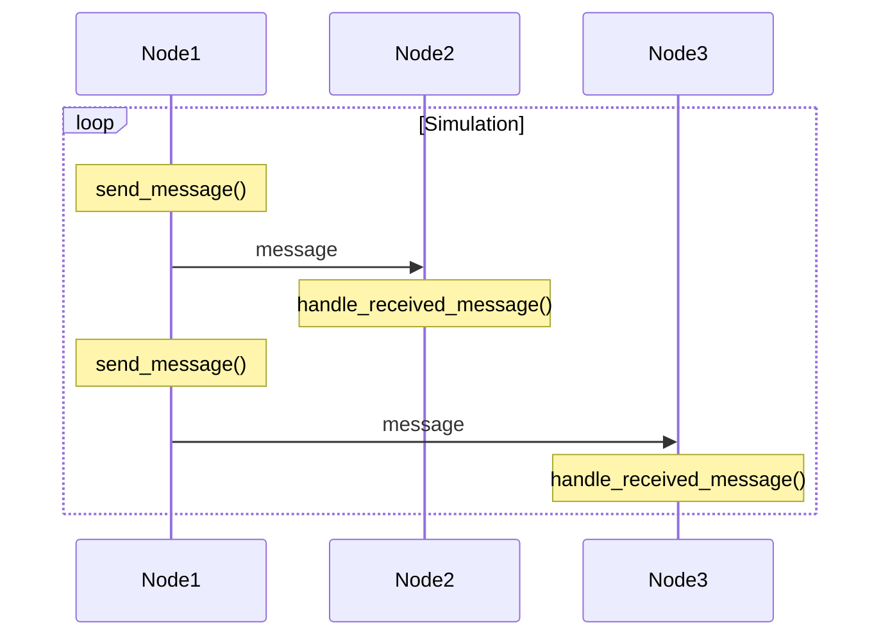

# Flood Publishing Simulation

This simulation creates a number of nodes in which flood publishing is enabled
and help users to measure the latency of messages.

In this simulation, each node logs the time when send_message() and handle_received_message()
are called. (The functions are defined in rust-libp2p side. So this simulation uses
a forked rust-libp2p that includes the logging.)



Using `measure_latency.py` we can measure the time between `send_message()` on the publisher side
and `handle_received_message()` on the receiver side.

## Running the Simulation

This simulation can be run with the following command (from within the repos
root directory):

The type of flood publishing can be switched via `--test-param flood_publish=heartbeat`. Please read
the `flood_publishing/manifest.toml` to understand test parameters.

```sh
testground run single \
  --plan gossipsub-testground/flood_publishing \
  --testcase flood_publishing \
  --builder docker:generic \
  --runner local:docker \
  --instances 50 \
  --wait \
  --test-param flood_publish=heartbeat \
  | grep flood_publishing_test \
  | python3 flood_publishing/measure_latency.py
```
