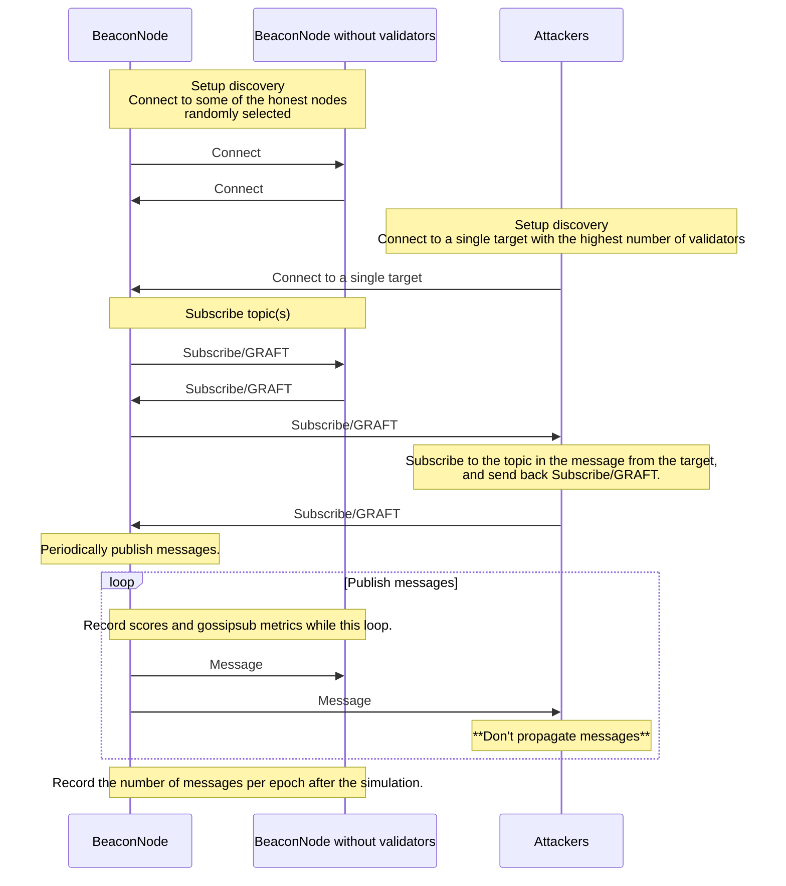

# Scoring Simulation

This simulation creates a number of malicious nodes which do not propagate
received messages, and mimics gossipsub messages on an Ethereum consensus network.

## Running the Simulation

This simulation can be run with the following command (from within the repos
root directory):

```sh
testground run composition -f ./scoring/compositions/simulation.toml --wait
```

Various aspects of the simulation can be modified. Please read the
`scoring/manifest.toml` to understand test parameters and
`scoring/compositions/simulation.toml` to modify them.


## Scenario: Censor Attack Against a Single Target



## Dashboards

Please see the root [README](../README.md) for how to run Grafana.

### Settings

Settings of the specific run. (e.g. topology)

Variables for this dashboard:

- `run_id`: The run_id for the test run you want to see.


### Messages

The number of messages (min, max, mean) each peers received per epoch.

Variables for this dashboard:

- `run_id`: The run_id for the test run you want to see.


### Peer Scores and Gossipsub Metrics

Variables for this dashboard:

- `run_id`: The run_id for the test run you want to see.
- `peer_id`: The PeerId you want to see.
	- Note: The censoring target ID can be found on the `Settings` dashboard.


